# Tempest — Incident Investigation Report

**Analyst:** Amal Shaji  
**Platform:** TryHackMe SOC Level 1 Capstone  
**Type:** Endpoint Forensics and Network Traffic Analysis  
**Artifacts:** Sysmon Logs, Windows Event Logs, Network Packet Capture  

---

## Task 1 — Preparation

### Overview

Before any investigation begins, the provided 
artifacts must be verified, and the analysis 
environment prepared. This ensures evidence 
integrity before analysis starts, a 
fundamental step in any DFIR engagement.

---

### Artifacts Received

The first step was listing the contents of 
the provided directory to confirm all three artefacts were present and accounted for.

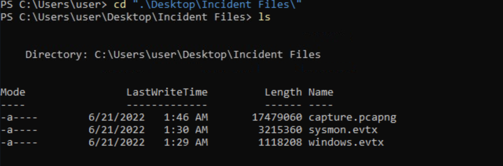

| Artefact | Type |
|----------|------|
| capture.pcapng | Network packet capture |
| sysmon.evtx | Sysmon event log |
| Windows Event Logs | Endpoint logs |

---

### Hash Verification

SHA-256 hashes were generated for all three
artifacts using PowerShell's Get-FileHash
command. This confirms the integrity of each 
file, ensuring no tampering has occurred 
since collection and providing a reference 
hash for future verification.

```powershell
Get-FileHash capture.pcapng
Get-FileHash sysmon.evtx
Get-FileHash windows.evtx
```

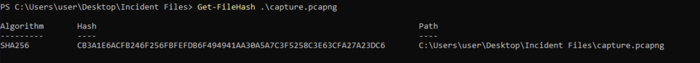
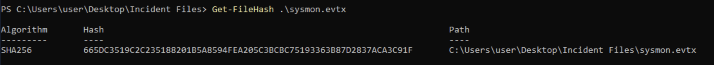
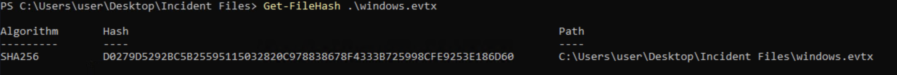

---

### Log Conversion

The Sysmon .evtx file was converted to CSV 
format using EvtxECmd. This makes the log 
data structured and filterable, allowing 
it to be ingested into Timeline Explorer 
for timeline-based analysis.

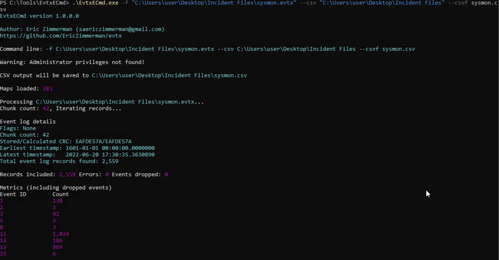

---

### Timeline Explorer

The converted CSV file was imported into 
Timeline Explorer, providing a chronological 
and filterable view of all Sysmon events 
across the full investigation period. This 
forms the primary analysis interface for 
the endpoint investigation tasks that follow.

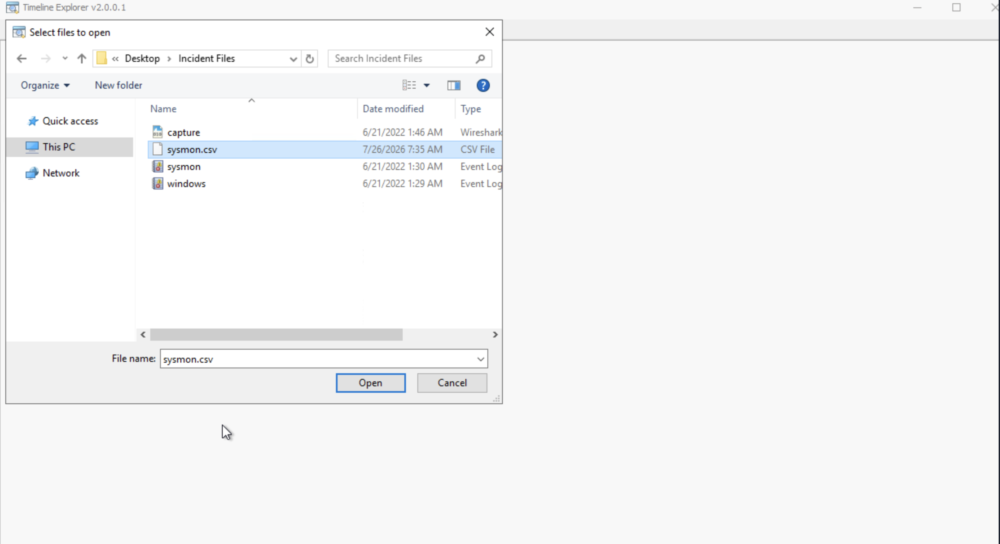

---

### Skills Applied

- Directory enumeration and artifact
  identification
- SHA-256 hash generation using PowerShell
  Get-FileHash
- Windows Event Log conversion using EvtxECmd
- Timeline construction using Timeline Explorer

---

## Task 2 — Initial Access — Malicious Document

### Scenario

The SOC team flagged a CRITICAL severity alert 
requiring further investigation. The analyst 
confirmed the intrusion originated from a 
malicious document with the following known 
information:

- The malicious document has a .doc extension
- The user downloaded it via chrome.exe
- The document executed a chain of commands
  to attain code execution

---

### Investigation Process

**Step 1 — Identifying the malicious document**

Starting from the known information that the 
document was downloaded via Chrome, I filtered 
Timeline Explorer for chrome.exe activity. 
This returned the malicious document filename
— `free_magicules.doc` — confirming it was 
downloaded through the browser onto the 
compromised machine.

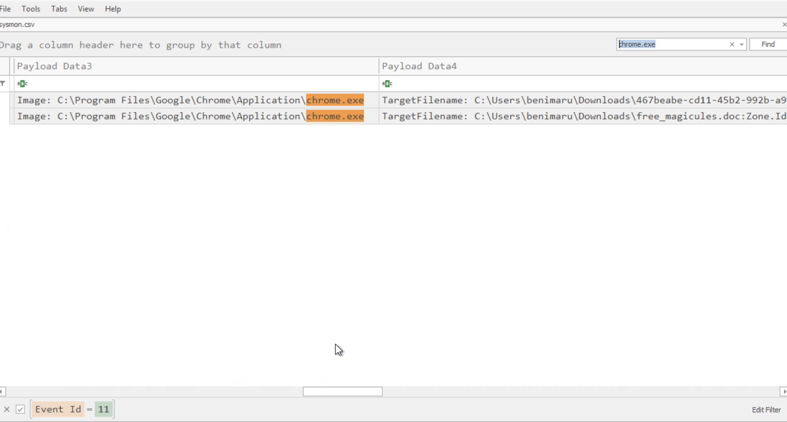

---

**Step 2 — Identifying the compromised user 
and machine**

Searching for `free_magicules.doc` in Timeline 
Explorer returned the associated Sysmon events, 
revealing the username and machine name of the 
compromised endpoint. This established the 
scope of the compromise and confirmed which 
account was affected.

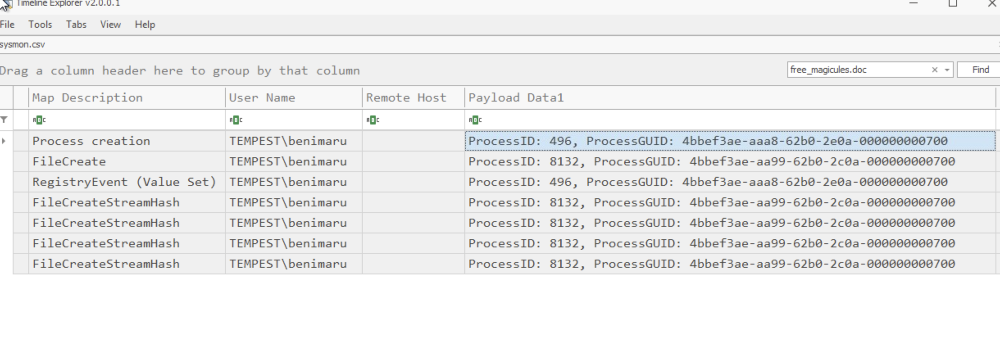

---

**Step 3 — Identifying the Microsoft Word PID**

The malicious document was opened in Microsoft
Word. Filtering Timeline Explorer for Word 
process creation events associated with
`free_magicules.doc` returned the Process ID 
of the Microsoft Word instance that executed 
the document — PID 496. This PID became the 
central pivot point for all subsequent 
investigation steps.

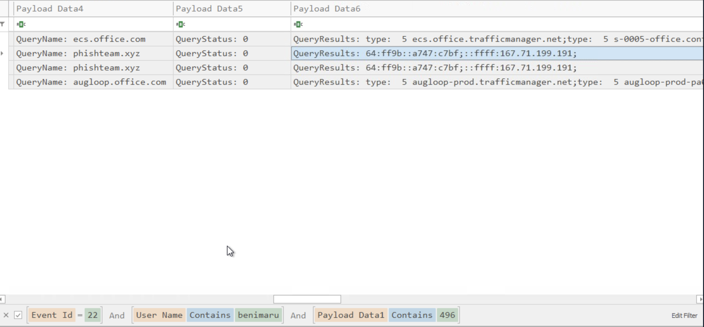

---

**Step 4 — Identifying the malicious domain 
and encoded payload**

Using PID 496 as the pivot, I applied the 
following filters in Timeline Explorer:

- Username: `benimaru`
- Event ID: `22` — DNS Query
- Payload 1: `496`

Event ID 22 in Sysmon captures DNS queries 
made by processes. Filtering on the username, 
PID, and DNS query event type returned the
IPv4 address resolved by the malicious domain 
contacted by the document upon execution.

The same filter also revealed a Base64-encoded 
string present in the malicious payload 
executed by the document. Base64 encoding is 
commonly used by attackers to obfuscate 
commands and evade signature-based detection.

To understand the exploitation technique used 
by the malicious document, I searched for the 
CVE associated with SysWOW64\msdt.exe. This 
returned the specific CVE number and confirmed 
the vulnerability being exploited — providing 
context around the affected software version 
and the nature of the attack.

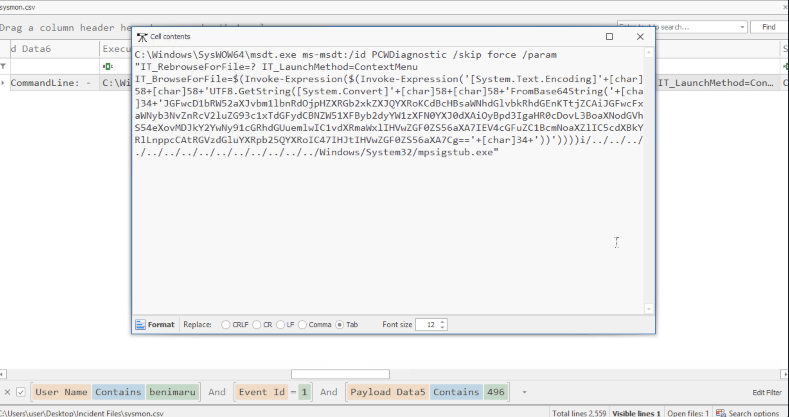
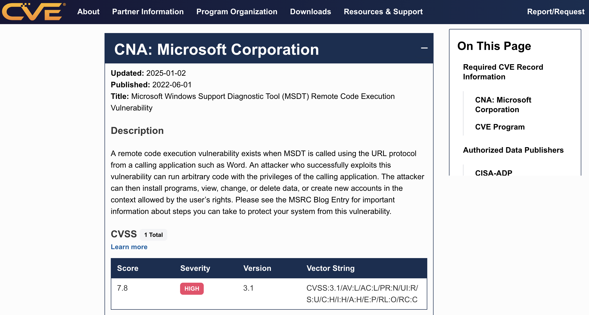

---

### Tools Used

| Tool | Purpose |
|------|---------|
| Timeline Explorer | Filtering Sysmon events by process, username, and Event ID |
| Sysmon Event ID 22 | DNS query events used to identify malicious domain |
| Internet research | Searched SysWOW64\msdt.exe CVE to identify the vulnerability exploited by the malicious document |

---

### Key Findings

| Finding | Detail | Source |
|---------|--------|--------|
| Malicious document | free_magicules.doc | Timeline Explorer — chrome.exe filter |
| Compromised username | benimaru | Timeline Explorer — document search |
| Compromised machine | Identified from Sysmon events | Timeline Explorer |
| Microsoft Word PID | 496 | Timeline Explorer — process creation |
| Malicious domain IPv4 | Identified via DNS query | Sysmon Event ID 22 |
| Encoded payload | Base64 encoded command string | Sysmon Event ID 22 |
| CVE number | Identified by searching SysWOW64\msdt.exe CVE — confirmed CVE details through internet research | Internet research |

---

### Analyst Notes

The use of PID 496 as a pivot point across
multiple filter combinations was the key
methodology in this task. Rather than searching
broadly across all events, anchoring filters
to the known PID of the Word process that
opened the malicious document significantly
narrowed results and surfaced the relevant
DNS and payload events quickly.

The Base64 encoding of the payload is a
classic obfuscation technique. Encoded
commands pass through many content filters
undetected — decoding them is a standard
step in any document-based malware
investigation.

---

## Task 3 — Initial Access Stage 2

## Task 3 — Initial Access Stage 2

### Overview

Following the initial malicious document execution
a second stage payload was deployed. This task
traces the full Stage 2 execution chain including
payload location, login-triggered execution command,
binary identification, and C2 establishment.

---

### Investigation Process

**Step 1 — Decoding the Base64 Payload**

The Base64-encoded string identified in Task 2
was decoded using CyberChef. Converting the 
encoded string to human-readable text revealed 
the actual command executed by the malicious 
document, providing clear visibility into the
attacker's intentions at this stage of the 
attack chain.


---

**Step 2 — Finding the Stage 2 Payload Path**

To identify where the Stage 2 payload was
written on the filesystem I applied the
following filters in Timeline Explorer:

- Username: `benimaru`
- Event ID: `11` — File Create
- Payload data: `startup`

Sysmon Event ID 11 captures file creation
events. Filtering on the username and the
startup keyword returned the full target
path where the Stage 2 payload was written
on the compromised machine.


---

**Step 3 — Identifying the Login-Triggered
Execution Command**

To find the command configured to execute
automatically upon user login I applied the
following filters in Timeline Explorer:

- Username: `benimaru`
- Event ID: `1` — Process Create
- Payload 4: `explorer`

Event ID 1 captures process creation events.
Filtering on explorer as the parent process
is significant because explorer.exe is the
Windows shell — processes launched at login
are typically spawned as children of
explorer.exe. This filter returned the full
command configured to execute automatically
whenever the compromised user logged in.


---

**Step 4 — Finding the SHA-256 Hash of the
Stage 2 Binary**

The payload path identified in Step 2 revealed
the Stage 2 binary location:

```
C:\Users\Public\Downloads\first.exe
```

Using this path I applied the following
filters in Timeline Explorer:

- Username: `benimaru`
- Executable info: `C:\Users\Public\Downloads\first.exe`

This returned the SHA-256 hash of the
malicious binary — confirming its identity
and providing an IOC for threat intelligence
lookups.


---

**Step 5 — Identifying the C2 Domain and Port**

Switching to Wireshark I analysed the network
packet capture to identify the C2 domain and
port used by the Stage 2 binary to communicate
with the attacker's infrastructure.

Network traffic analysis revealed:

- **C2 Domain:** resolvecyber[.]xyz
- **Port:** 80

The use of port 80 is a deliberate evasion
technique. HTTP traffic on port 80 blends with
normal web browsing traffic making it
significantly harder to detect through
port-based network monitoring alone. Behavioural
analysis and content inspection are required
to identify malicious HTTP traffic of this type.


---

### Tools Used

| Tool | Purpose |
|------|---------|
| CyberChef | Base64 decoding of obfuscated payload |
| Timeline Explorer | Filtering Sysmon events by Event ID, username, and payload data |
| Sysmon Event ID 11 | File creation events — identifying Stage 2 payload path |
| Sysmon Event ID 1 | Process creation events — identifying login-triggered command |
| Wireshark | Network traffic analysis — C2 domain and port identification |

---

### Key Findings

| Finding | Detail | Source |
|---------|--------|--------|
| Decoded payload | Human-readable attacker command | CyberChef |
| Stage 2 payload path | Full filesystem path of dropped binary | Sysmon Event ID 11 |
| Login-triggered command | Full command executing on user login | Sysmon Event ID 1 |
| Stage 2 binary | first.exe | Sysmon file events |
| Stage 2 binary SHA-256 | Confirmed hash of malicious binary | Timeline Explorer |
| C2 domain | resolvecyber[.]xyz | Wireshark |
| C2 port | 80 | Wireshark |

---

### Analyst Notes

The choice of port 80 for C2 communication is
a deliberate and common attacker technique.
By routing malicious traffic over standard
HTTP the attacker blends into normal network
activity. This highlights why deep packet
inspection and behavioural analysis are
essential alongside traditional port-based
firewall rules.

Filtering on explorer.exe as the parent
process for Event ID 1 was the key pivot
in identifying the login-triggered command.
Understanding Windows process hierarchy is
fundamental to efficient Sysmon log
investigation — knowing which processes
spawn which children significantly narrows
filter combinations and surfaces relevant
events faster.

---

## Task 4 — C2 Traffic Analysis


### Overview

This task focused entirely on network traffic
analysis using Wireshark and CyberChef to
identify the malicious payload delivery URL,
C2 communication patterns, encoding methods,
and the programming language used to compile
the malicious binary.

---

### Investigation Process

**Step 1 — Finding the Malicious Payload URL**

Using Wireshark I applied the filter:

```
http
```

This filtered all HTTP traffic in the packet
capture. Scanning through the results I
identified a packet containing a reference
to `free_magicules.doc` - the malicious
document identified in Task 2. This packet
confirmed the document was delivered over
HTTP and provided the starting point for
identifying the full delivery URL.


---

**Step 2 — Finding the Full Delivery URL**

To find the full URL used to deliver the
malicious document I applied the following
Wireshark filter:

```
http.host
```

Filtering on the host associated with the
document delivery returned the full URL
including the host `phishteam.xyz` and
confirmed the complete delivery path
ending with `index.html`.


---

**Step 3 — Identifying C2 Encoding and
Communication Parameters**

To investigate the C2 communication from
the Stage 2 binary I applied the following
Wireshark filter:

```
http contains "resolvecyber"
```

This filtered all HTTP traffic containing
references to `resolvecyber` — the C2
domain identified in Task 3. Examining
the resulting GET request revealed:

- **Encoding used:** Base64 — the attacker
  encoded C2 commands in Base64 to obfuscate
  communication and evade content-based
  detection
- **Parameter used to execute commands:** `q`
- **URL used by binary:** `/9ab62b5`
- **HTTP method:** GET


---

**Step 4 — Identifying the Programming Language**

To gather more context about the malicious
binary I right-clicked the relevant packet
and selected **Follow TCP Stream**. Examining
the full TCP stream content revealed that
the binary was compiled using **Nim** — a
systems programming language increasingly
used by threat actors due to its ability
to produce small, efficient executables
that are less commonly detected by
security tools.


---

**Step 5 — Decoding the Encoded C2 Command**

The Base64 encoded command found in the
C2 GET request was extracted and decoded
using CyberChef. The decoded output revealed
the command being sent by the attacker
through the C2 channel was:

```
whoami - benimaru
```

This is a standard attacker reconnaissance
command used to confirm the identity and
privilege level of the compromised account
immediately after establishing C2
communication.


---

### Tools Used

| Tool | Purpose |
|------|---------|
| Wireshark | HTTP traffic filtering and TCP stream analysis |
| CyberChef | Base64 decoding of encoded C2 command |

---

### Key Findings

| Finding | Detail | Source |
|---------|--------|--------|
| Malicious payload delivery host | phishteam.xyz | Wireshark http.host filter |
| Full delivery URL | phishteam.xyz/index.html | Wireshark HTTP filter |
| C2 encoding method | Base64 | Wireshark resolvecyber filter |
| C2 command parameter | q | Wireshark GET request |
| C2 URL path | /9ab62b5 | Wireshark GET request |
| HTTP method | GET | Wireshark HTTP filter |
| Binary programming language | Nim | Wireshark Follow TCP Stream |
| Decoded C2 command | whoami | CyberChef |

---

### Analyst Notes

The use of Base64 encoding for C2 commands
over HTTP GET requests on port 80 is a
deliberate layered evasion technique. The
attacker combined three evasion methods
simultaneously — standard HTTP protocol,
common port 80, and encoded payloads — to
blend malicious traffic with normal web
browsing activity.

The `whoami` command as the first C2
instruction is consistent with standard
attacker post-exploitation behaviour.
Confirming the identity and privilege level
of the compromised account is the first
step before deciding which escalation or
lateral movement technique to pursue next.

The identification of Nim as the compilation
language is a significant threat intelligence
finding. Nim-compiled binaries are
increasingly used by threat actors because
they produce executables with lower detection
rates against traditional antivirus and EDR
solutions compared to more commonly flagged
languages like C or PowerShell.

---

## Task 5 — Discovery

### Overview

With C2 communication established the attacker
conducted internal discovery on the compromised
machine. This task traces how the attacker
identified a sensitive file and its password,
discovered a listening port providing remote
shell access, established a reverse proxy
using Chisel, and authenticated to the machine
using a specific Windows service.

---

### Investigation Process

**Step 1 — Finding the Sensitive File Password**

Returning to Wireshark I applied the following
combined filter to isolate C2 GET requests
to the resolvecyber domain:

```
http.host == resolvecyber.xyz && http.request.method == "GET"
```

This returned a number of packets containing
Base64 encoded commands sent through the C2
channel. Each packet was extracted and decoded 
individually using CyberChef. Working through
the decoded outputs one by one I identified
a specific packet whose decoded content
contained a password — `infernotempest` —
revealing the password of the sensitive file
discovered by the attacker on the compromised
machine.


---

**Step 2 — Identifying the Listening Port**

Continuing through the remaining encoded
packets from the same Wireshark filter I
identified another packet whose decoded
content revealed a `netstat` command output.
The decoded netstat results contained a list
of active network connections, process IDs,
and listening ports on the compromised machine.

Analysing the output I identified the
listening port providing remote shell access
to the machine — PID 5985 — confirming an
active listening service the attacker could
use for remote access.


---

**Step 3 — Finding the Reverse Proxy Command
and SHA-256 Hash**

Returning to Timeline Explorer I searched for
the reverse proxy activity. Filtering for the
SOCKS reverse proxy command returned the full
command executed by the attacker to establish
the Chisel reverse proxy connection — providing
complete visibility into how the attacker
tunnelled their C2 traffic through the
compromised machine.

The same filter also returned the SHA-256
hash of the Chisel binary directly from the
Sysmon event data.


---

**Step 4 — Identifying the Tool Using VirusTotal**

The SHA-256 hash of the binary was submitted
to VirusTotal for threat intelligence lookup.
The results confirmed the binary as **Chisel**
— a legitimate open-source TCP and UDP
tunnelling tool written in Go that is
increasingly abused by threat actors to
establish reverse proxy connections and
tunnel C2 traffic through compromised
endpoints.


---

**Step 5 — Identifying the Authentication Service**

Returning to Timeline Explorer, I searched for
`wsmprovhost` — the Windows Remote Management
(WinRM) provider host process. This process 
is associated with PowerShell remoting and
WinRM-based authentication.

The search confirmed that `wsmprovhost.exe`
was the service used by the attacker to
authenticate to the compromised machine —
consistent with the listening port 5985
identified in Step 2, which is the default
WinRM HTTP port.


---

### Tools Used

| Tool | Purpose |
|------|---------|
| Wireshark | HTTP GET request filtering to isolate C2 commands |
| CyberChef | Base64 decoding of encoded C2 command outputs |
| Timeline Explorer | Reverse proxy command and hash identification |
| VirusTotal | Binary hash lookup confirming Chisel |

---

### Key Findings

| Finding | Detail | Source |
|---------|--------|--------|
| Sensitive file password | infernotempest | Wireshark and CyberChef |
| Listening port | 5985 | Wireshark netstat decode via CyberChef |
| Reverse proxy command | Full SOCKS command recovered | Timeline Explorer |
| Chisel binary SHA-256 | Confirmed hash | Timeline Explorer |
| Tool name | Chisel | VirusTotal |
| Authentication service | wsmprovhost — WinRM | Timeline Explorer |

---

### Analyst Notes

The methodology of iterating through multiple
Base64 encoded C2 packets and decoding each
one individually was time consuming but
essential. The attacker sent multiple commands
through the C2 channel and the sensitive
findings, the file password and the netstat
output were not immediately obvious without
working through all of them systematically.

The identification of port `5985` alongside
wsmprovhost.exe is significant. Port `5985`
is the default WinRM HTTP port used for
PowerShell remoting. The attacker leveraged
WinRM as their authentication mechanism 
a legitimate Windows service used to avoid
raising suspicion. This is another example
of living-off-the-land technique where
built-in Windows services are abused for
malicious purposes.

The use of Chisel for reverse proxy 
establishment is consistent with real-world
threat actor TTPs. By tunnelling C2 traffic 
through a legitimate-looking TCP connection, 
the attacker significantly reduces the 
likelihood of detection through standard 
network monitoring. Detection requires 
behavioural analysis — specifically looking 
for unusual outbound connections from 
unexpected processes.

---

## Task 6 — Privilege Escalation

### Overview

With an established foothold, the attacker moved 
to escalate privileges on the compromised machine. 
This task traces the full privilege escalation 
chain, from binary download and identification 
through to privilege abuse and elevated C2
port discovery.

---

### Investigation Process

**Step 1 — Finding the Privilege Escalation 
Binary Name and Hash**

Returning to Timeline Explorer, I searched for
`wsmprovhost` in the find filter. This pivoted 
from the authentication service identified in 
Task 5 and revealed subsequent process activity 
spawned under that context.

The results showed the attacker executed a 
download command retrieving a binary named
`spf.exe` onto the compromised machine. The 
same Sysmon event data also contained the
SHA-256 hash of the downloaded binary, 
providing an immediate IOC for threat 
intelligence lookup.


---

**Step 2 — Identifying the Tool Using VirusTotal**

The SHA-256 hash of `spf.exe` was submitted 
to VirusTotal for threat intelligence lookup. 
The results confirmed the binary as ** PrintSpoofer **, a well-known privilege-
escalation tool developed by itm4n that 
abuses impersonation privileges through 
the Windows printer spooler service.


---

**Step 3 — Identifying the Abused Privilege**

To understand the specific Windows privilege 
exploited for escalation, I conducted a Google 
search and reviewed the PrintSpoofer GitHub 
repository by itm4n. The repository confirmed 
that PrintSpoofer specifically abuses the ** SeImpersonatePrivilege **, a Windows token 
privilege that allows a process to impersonate 
another user's security context.

SeImpersonatePrivilege is commonly assigned
to service accounts and is frequently found
on compromised machines where the initial
access was achieved through a web application
or service running under a limited account.
PrintSpoofer exploits this privilege to 
impersonate the SYSTEM account, achieving 
full administrative control of the machine.

---

**Step 4 — Finding the C2 Port Used by
the Elevated Binary**

To identify the port used by the attacker 
for the elevated C2 connection, I returned
to Wireshark and applied the following 
combined filter:

```
http && ip.src == 167.71.222.162
```

This filtered HTTP traffic originating from 
the attacker's IP address. I then added
**Source Port** as a column in Wireshark 
to surface the port information directly 
in the packet list view. Examining the 
filtered results confirmed the elevated
C2 connection was operating on port **8080**.


---

### Tools Used

| Tool | Purpose |
|------|---------|
| Timeline Explorer | wsmprovhost pivot to identify spf.exe download and SHA-256 hash |
| VirusTotal | Hash lookup confirming PrintSpoofer |
| Google and GitHub research | SeImpersonatePrivilege identification and PrintSpoofer methodology |
| Wireshark | HTTP traffic filtering to identify elevated C2 port |

---

### Key Findings

| Finding | Detail | Source |
|---------|--------|--------|
| Privilege escalation binary | spf.exe | Timeline Explorer |
| Binary SHA-256 hash | Confirmed hash | Timeline Explorer |
| Tool name | PrintSpoofer | VirusTotal |
| Tool author | itm4n | GitHub research |
| Abused privilege | SeImpersonatePrivilege | GitHub and Google research |
| Elevated C2 port | 8080 | Wireshark |

---

### Analyst Notes

The pivot from `wsmprovhost` identified in 
Task 5 directly into the privilege escalation 
activity in this task demonstrates the value 
of maintaining a consistent investigation 
thread across tasks. Rather than starting 
fresh each task, carrying forward known 
process names and pivoting from them 
significantly accelerates the investigation.

The use of PrintSpoofer is consistent with
real-world post-exploitation TTPs. It is 
a widely known tool but remains effective 
because SeImpersonatePrivilege is frequently 
present on compromised service accounts. 
Monitoring for the creation and execution 
of known privilege escalation binaries 
through Sysmon process creation events 
and hash-based detection rules would catch 
this activity before escalation succeeds.

The shift from port 80 in Task 3 to port
8080 in this task is notable. After 
escalating privileges, the attacker established 
a new elevated C2 channel on a different port, likely to separate privileged 
communications from the initial lower-
privilege C2 session and reduce the risk 
of both being detected and blocked 
simultaneously.

---

## Task 7 — Persistence

### Overview

The final phase of the investigation covers 
how the attacker ensured continued access 
to the compromised machine. This task 
identifies the new accounts created by the 
attacker, the commands used to add them to 
privileged groups, and the mechanism used 
to establish persistent administrative 
access through a Windows service.

---

### Investigation Process

**Step 1 — Identifying the Accounts Created 
by the Attacker**

To identify the new accounts created by the attacker, I applied the following filters in 
Timeline Explorer:

- Event ID: `1` — Process Create
- Parent command: `file.exe`

This returned two process creation events 
showing commands executed to add two new 
local user accounts to the compromised 
machine. The two accounts created were:

- **shion**
- **shuna**

The commands also revealed that one of the
account creation attempts had a missing
`/add` option, confirming the attacker
made an error during the account creation 
process.


---

**Step 2 — Finding the Group Addition Command**

To identify which account was added to the 
local administrators group I applied the 
following filters in Timeline Explorer:

- Event ID: `1` — Process Create
- Parent command: `file.exe`
- Username: `system`

Filtering on the SYSTEM username was key 
here — commands executed with SYSTEM-level 
privileges following the privilege escalation 
in Task 6 would run under the SYSTEM context. 
This filter returned the command used to add 
one of the newly created accounts to the 
local administrators group:

```
net localgroup administrators /add shion
```

The associated Windows Event ID for a sensitive 
local group addition is **4732**, confirming 
a member was added to a security-enabled
local group.


---

**Step 3 — Identifying the Persistent 
Administrative Access Mechanism**

To find how the attacker established 
persistent administrative access, I used
`final.exe` as a search filter in Timeline 
Explorer. This returned the full command 
executed by the attacker to create a 
persistent Windows service:

```
C:\Windows\system32\sc.exe \\TEMPEST create 
TempestUpdate2 binpath= C:\ProgramData\final.exe 
start= auto
```

Breaking this command down:

- `sc.exe` — Windows Service Control Manager
  utility used to create, modify, and manage
  Windows services
- `\\TEMPEST` — the target machine name
- `create TempestUpdate2` — creates a new
  service named TempestUpdate2 — disguised
  as a legitimate update service
- `binpath= C:\ProgramData\final.exe` — sets
  the service binary to the attacker's
  malicious executable
- `start= auto` — configures the service to
  start automatically on every system boot

This mechanism ensures `final.exe` executes 
automatically every time the machine boots, providing the attacker with persistent 
elevated access that survives reboots, 
credential resets, and session terminations.

The associated Windows Event IDs relevant 
to account creation and group modification 
are:

| Event ID | Description |
|----------|-------------|
| 4720 | A user account was created |
| 4732 | A member was added to a security-enabled local group |


---

### Tools Used

| Tool | Purpose |
|------|---------|
| Timeline Explorer | Event ID and process filter pivoting to identify account creation, group addition, and persistence commands |

---

### Key Findings

| Finding | Detail | Source |
|---------|--------|--------|
| New accounts created | shion and shuna | Timeline Explorer — Event ID 1, parent file.exe |
| Failed command | Missing /add option in account creation | Timeline Explorer |
| Account creation Event ID | 4720 | Windows Security Event Logs |
| Group addition command | net localgroup administrators /add shion | Timeline Explorer — System filter |
| Group addition Event ID | 4732 | Windows Security Event Logs |
| Persistence command | sc.exe create TempestUpdate2 binpath= final.exe start= auto | Timeline Explorer — final.exe filter |
| Persistence mechanism | Windows service configured to auto-start on boot | Timeline Explorer |

---

### Analyst Notes

The naming of the persistence service as
`TempestUpdate2` is a deliberate masquerading 
technique. By naming the malicious service 
to resemble a legitimate system update process, the attacker reduces the likelihood 
of the service being noticed during a 
casual review of running services. This 
highlights why monitoring for new service 
creation events, particularly those 
pointing to binaries in non-standard paths 
like `C:\ProgramData\`, is a critical 
detection capability in any SOC environment.

The combination of account creation, 
group elevation, and service-based persistence 
represents a comprehensive persistence 
strategy. Even if the initial malicious 
binary is detected and removed, the attacker 
retains access through the created accounts. 
Even if the accounts are removed, the service 
restarts the malware on next boot. Effective 
remediation requires addressing all three 
persistence mechanisms simultaneously.

The error in the account creation command
— the missing `/add` option is another noteworthy human element. Even sophisticated 
attackers make mistakes. These errors often 
leave additional artifacts in logs that can 
help investigators reconstruct the attack 
timeline more completely.

---

## Investigation Summary

This investigation successfully reconstructed
the complete attack chain across all seven
phases of the Tempest compromise.

| Task | Phase | Key Finding |
|------|-------|-------------|
| 1 | Preparation | Artefacts verified and analysis environment prepared |
| 2 | Initial Access | free_magicules.doc delivered via Chrome — PID 496 pivot |
| 3 | Stage 2 | first.exe dropped — C2 to resolvecyber.xyz on port 80 |
| 4 | C2 Traffic | Base64 encoded commands over HTTP GET — Nim compiled binary |
| 5 | Discovery | Password infernotempest — Chisel reverse proxy — WinRM auth |
| 6 | Privilege Escalation | PrintSpoofer abusing SeImpersonatePrivilege — port 8080 |
| 7 | Persistence | Two accounts created — shion admin — TempestUpdate2 service |

---

### Defensive Recommendations

**1. Email and document security**
Implement sandboxed analysis of all 
downloaded documents. A single malicious
.doc file initiated the entire compromise.

**2. Monitor Event ID 4720 and 4732**
New account creation and group membership 
changes should trigger immediate high-
priority alerts in any SIEM deployment.

**3. Monitor service creation**
Alert on new Windows service creation, particularly services with binaries located 
in non-standard paths such as C:\ProgramData \ or C:\Users\Public\.

**4. Restrict SeImpersonatePrivilege**
Audit which accounts hold 
SeImpersonatePrivilege and remove it 
where not explicitly required. This 
directly mitigates PrintSpoofer and 
similar token impersonation attacks.

**5. Behavioural detection for Chisel
and tunnelling tools**
Signature-based detection alone will not 
catch Chisel. Implement behavioural rules 
alerting on unusual outbound connections 
from non-browser processes on standard 
HTTP ports.

---

*Investigation completed by Amal Shaji*
*TryHackMe SOC Level 1 Capstone — Tempest*
